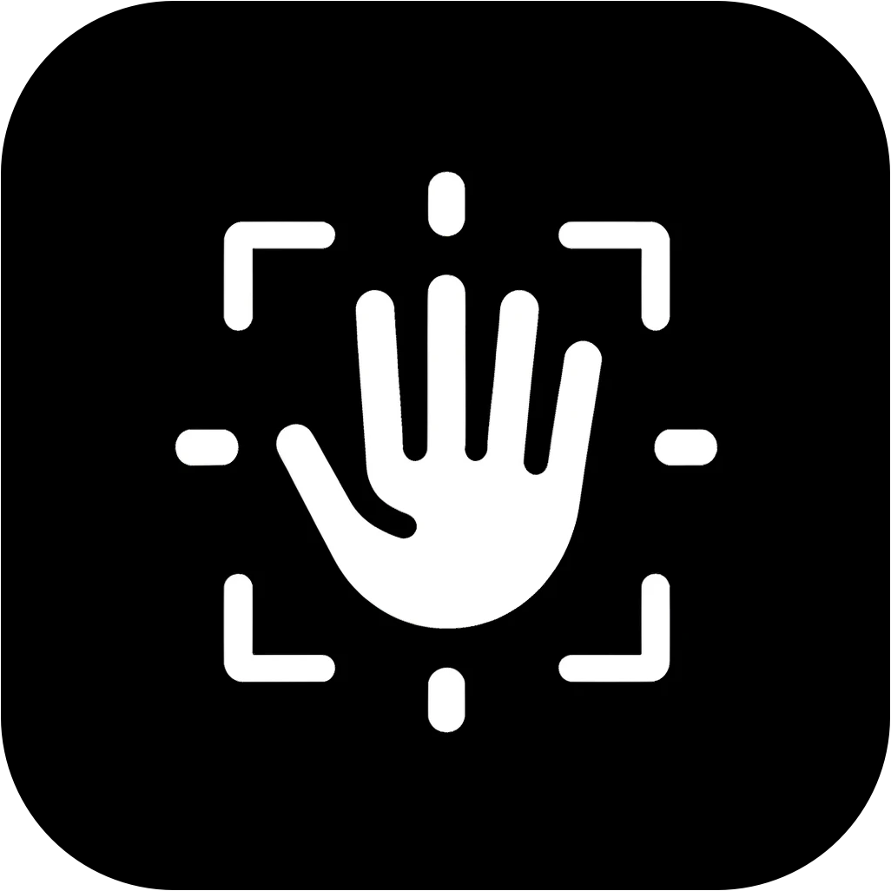

# handTrack
> This Python script allows you to control your computer's mouse cursor using hand gestures, with the help of a webcam. It uses OpenCV for image processing, MediaPipe for hand tracking, and PyAutoGUI for simulating mouse movements and clicks.

<br><br/>
<p align="center">
  
</p>

## Features

- **Mouse Movement**: Just move your hand in front of the screen to control the mouse. It's like using the force.
- **Mouse Click**: Touch your index and thumb together to click the mouse.

## Prerequisites

Before you can use this script, you'll need to have Python installed on your machine, along with a few libraries. This guide assumes you have Python 3.6 or newer. (I used 3.11)

## Installation

1. **Clone the Repository**
   First, clone this repository to your local machine using:

   ```bash
   git clone https://github.com/small-cactus/handTrack.git
   cd handTrack
   ```

2. **Set Up a Python Virtual Environment** (optional but recommended)

   ```bash
   python -m venv venv
   
   venv\Scripts\activate      # On Windows
   
   source venv/bin/activate   # On macOS and Linux
   ```

3. **Install Required Libraries**
   Install the required Python libraries with:

   ```
   pip install -r requirements.txt
   ```

   Here's what's installed, you don't need to do any step for this:

   ```
   opencv-python==4.5.5.64
   mediapipe==0.8.11
   numpy==1.23.3
   pyautogui==0.9.53
   ```

## Configuration (In case defaults don't work)

Before running the script, you might need to adjust a few parameters based on your webcam setup and personal preferences:

- **Camera Index**: If your system has multiple cameras and the script does not use the correct one, change the `cap = cv2.VideoCapture(0)` line. Replace `0` with the index of the desired camera.
- **Detection Confidence**: Adjust `min_detection_confidence` and `min_tracking_confidence` in the hand tracking setup section if the script is too sensitive or not sensitive enough.
- **Model Complexity**: Change `model_complexity` in the hand detection setup. Use `1` (default) for a balance between performance and accuracy, or try `0` for faster but less accurate detection, and `2` for more accurate but slower detection.
- **Distance Threshold**: If your fingers need to be closer or further apart to register a click, modify the `threshold` parameter in the `are_fingertips_touching` function.

## Usage

Run the script from your command line:

   ```
   python3 handTrack.py
   ```

Make sure you have sufficient lighting and your hand is visible to the webcam for best performance.

## Troubleshooting

- **Script Doesn't Recognize Hand Movements**: Ensure your hand is well-lit and within the frame. Adjust the confidence thresholds if necessary.
- **Mouse Movements Are Erratic**: Try adjusting the screen coordinates mapping in `convert_to_screen_coordinates` to match your screen size more accurately.
- **Clicks Are Not Registering**: Modify the `threshold` in the `are_fingertips_touching` function. You might need to increase or decrease this value based on your hand size and camera distance.

## License

This project is licensed under the MIT License - see the LICENSE file for details.
